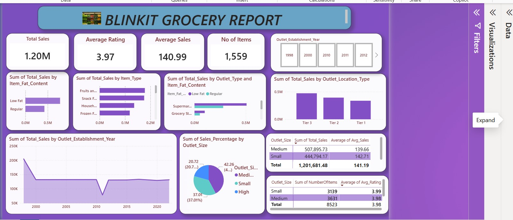

# BlinkIT-Grocery-Data
Data analytics project featuring SQL data exploration and Power BI visualization of Blinkit grocery sales, inventory performance, customer ratings, and business insights
# 🛒 BlinkIT Grocery Sales Analysis Dashboard

## 📖 Project Overview

This project analyzes BlinkIT grocery sales data using SQL Server and Power BI to uncover business insights related to sales performance, product categories, outlet characteristics, and customer satisfaction.

The objective of this analysis is to identify key revenue drivers, evaluate outlet performance, understand customer purchasing behavior, and provide actionable recommendations to support business growth and operational efficiency.

---

## 🎯 Business Objectives

The analysis aims to answer the following business questions:

- What is the overall sales performance of the business?
- Which product categories generate the highest revenue?
- How does fat content affect sales performance?
- Which outlet types contribute the most sales?
- Which outlet locations perform best?
- How do outlet sizes influence revenue generation?
- How satisfied are customers based on product ratings?
- How has outlet performance varied by establishment year?

---

## 🛠️ Tools Used

- Microsoft SQL Server
- Power BI
- GitHub

---

## 📂 Dataset Information

The dataset contains information about grocery products, outlet characteristics, sales transactions, and customer ratings.

### Columns

- Item Fat Content
- Item Identifier
- Item Type
- Outlet Establishment Year
- Outlet Identifier
- Outlet Location Type
- Outlet Size
- Outlet Type
- Item Visibility
- Item Weight
- Total Sales
- Rating

---

## 🧹 Data Cleaning Process

The following data cleaning activities were performed using SQL Server:

- Checked for missing values
- Standardized Item Fat Content values
- Removed duplicate records
- Validated data consistency
- Verified numerical fields
- Prepared the dataset for reporting and visualization

---

## 📊 Key Performance Indicators (KPIs)

| KPI | Value |
|------|------:|
| Total Sales | ₦1.20M |
| Average Sales | ₦140.99 |
| Number of Items | 1,559 |
| Average Rating | 3.97 |

---

## 📈 Dashboard Preview

> Add your dashboard screenshot below.

---

# 🔍 Key Insights

## 1. Low-Fat Products Generate Higher Revenue

Analysis shows that Low-Fat products contribute significantly more sales revenue than Regular products.

### Business Implication

Consumers appear to prefer healthier product options, indicating growing demand for health-conscious grocery products.

### Recommendation

- Increase inventory levels of low-fat products.
- Expand healthy product categories.
- Promote low-fat products through targeted marketing campaigns.

---

## 2. Fruits & Vegetables Are the Highest Revenue-Generating Category

Among all product categories, Fruits and Vegetables contribute the largest share of total sales.

### Business Implication

Fresh produce remains a major driver of customer purchases and store traffic.

### Recommendation

- Maintain adequate stock levels.
- Strengthen supplier relationships.
- Introduce bundle promotions for fresh produce products.

---

## 3. Supermarket Outlets Outperform Grocery Stores

Supermarket outlets generate substantially higher revenue compared to grocery stores.

### Business Implication

Customers prefer shopping in larger outlets due to wider product variety and convenience.

### Recommendation

- Prioritize investment in supermarket outlet formats.
- Improve product assortment in smaller grocery stores.
- Review the performance of underperforming outlet types.

---

## 4. Tier 3 Locations Generate the Highest Sales

Tier 3 locations contribute the highest overall revenue compared to Tier 1 and Tier 2 locations.

### Business Implication

Tier 3 markets represent a significant growth opportunity for the business.

### Recommendation

- Expand operations in Tier 3 locations.
- Conduct further analysis to identify drivers of Tier 3 success.
- Replicate successful strategies across other regions.

---

## 5. Medium-Sized Outlets Generate the Most Revenue

Medium-sized outlets contribute the highest sales among all outlet sizes.

### Business Implication

Medium-sized stores appear to provide the optimal balance between operating costs and revenue generation.

### Recommendation

- Focus future outlet expansion on medium-sized store formats.
- Use medium-sized outlets as the benchmark for new store development.

---

## 6. Customer Satisfaction Is Relatively Strong

The average customer rating of 3.97 out of 5 indicates generally positive customer experiences.

### Business Implication

Customers are largely satisfied with products and services offered.

### Recommendation

- Maintain service quality standards.
- Monitor customer feedback regularly.
- Identify highly rated outlets and replicate best practices.

---

## 7. Sales Performance Remains Stable Across Outlet Establishment Years

Sales remain relatively consistent across outlet establishment years, with only minor fluctuations observed.

### Business Implication

Older outlets continue to maintain stable performance levels.

### Recommendation

- Investigate periods of lower performance.
- Identify operational practices contributing to long-term outlet success.

---

# 📌 Business Recommendations

### Product Strategy

- Increase focus on low-fat product offerings.
- Expand high-performing product categories.
- Reduce stock-outs for top-selling products.

### Outlet Strategy

- Expand medium-sized outlet formats.
- Invest in Tier 3 markets.
- Improve underperforming outlet categories.

### Customer Strategy

- Enhance customer experience programs.
- Monitor customer satisfaction trends.
- Implement loyalty initiatives.

### Operational Strategy

- Track outlet performance regularly.
- Improve inventory planning processes.
- Develop predictive sales forecasting models.

---

# 📊 Dashboard Features

- KPI Monitoring
- Sales Performance Analysis
- Product Category Analysis
- Outlet Performance Analysis
- Customer Rating Analysis
- Interactive Filtering
- Trend Analysis

---

# 🚀 Project Outcome

This analysis identified key growth opportunities within the BlinkIT business.

The findings indicate that low-fat products, fruits and vegetables, medium-sized outlets, and Tier 3 locations are the primary drivers of revenue growth. These insights can support management decisions related to inventory optimization, outlet expansion, customer engagement, and long-term business strategy.

---

## 📁 Project Structure

- Dataset: Raw BlinkIT grocery dataset  
- SQL: Data cleaning and analysis scripts  
- Power BI: Dashboard file (.pbix)  
- Images: Dashboard screenshots

---

## 👤 Author

### Nkemjika Omazi

Data Analyst | Power BI Developer | SQL Analyst

This project demonstrates skills in:

- Data Cleaning
- SQL Analysis
- Data Visualization
- Business Intelligence
- Dashboard Development
- Insight Generation
- Business Reporting

